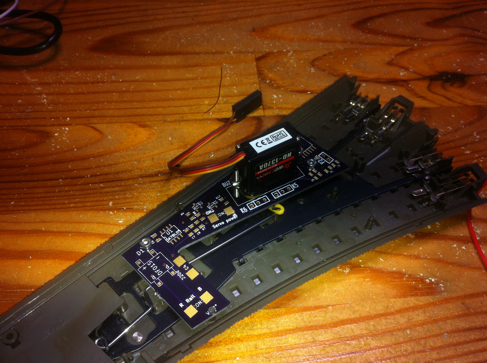
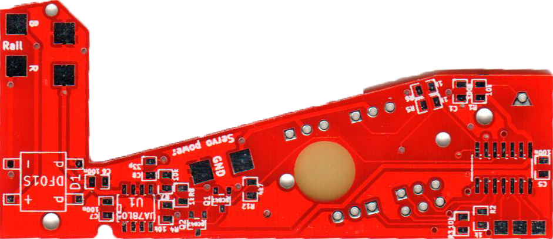
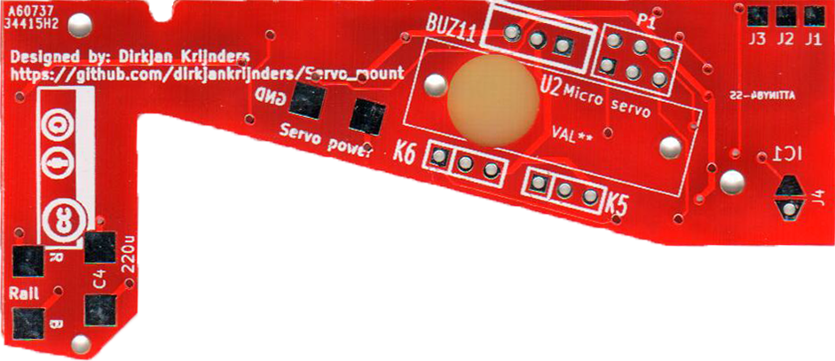

Servo mount
===========

Based on several threads on the dutch three-rail model railroad forum (for example [here](http://forum.3rail.nl/index.php?topic=36707.msg814683#msg814683)), I came up with the idea to combine a PCB of say a decoder with the mechanical mounting of a servo. (cheap to manufacture on small scale and very precise). The result:

The design is based on the [PSSD](https://github.com/dirkjankrijnders/PSSD), however using a different microcontroller (attiny84) for more memory options and smaller footprint. The construction also meant sacrificing the buttons, so another way of programming the decoder was needed. The ISP connector already planned also has the I2C lines available, so the decoder can now be configured by setting registers over I2C. An arduino sketch facilitates this process.

The decoder has not yet been tested on the PCB, but works on the breadboard. It support two servo's, so only half of the PCB's need their components placed, the second servo can be connected via standard servo wires.

I already found some issues with the electronics side of the decoder, so a second revision is planned. The second revision fixes most footprint issues as well as allowing mount in both left and right switches. Also all components have been moved to the back of the PCB so the build decoder should flush in the C rail ballast form.

Cost/BOM
--------

<table>
<tr>
<th>Part</th><th>#</th><th>Reichelt #</th><th>price* (€)</th>
</tr>
<tr><td>IC1</td><td>1</td><td>ATTINY 44A-SSU</td><td>1.07</td></tr>
<tr><td>D1</td><td>1</td><td>SMD DF 005</td><td>0.18</td></tr>
<tr><td>U1</td><td>1</td><td>µA 78L05 SMD</td><td>0.15</td></tr>
<tr><td>U2</td><td>1</td><td>BUZ 11</td><td>0.57</td></tr>
<tr><td>R*,C*</td><td>2</td><td></td><td>0.50**</td></tr>
<tr><td>PCB</td><td>1</td><td>Seeed</td><td>1.00</td></tr>
<tr><td colspan=3>Total</td><td>3.47</td></tr>
</table>
\* Estimate for orders of 10. 
\** SMD 0805 Components from cost almost nothing in bulk (&gt; 10)

Firmware
--------
To make to PSSD firmware:

	make BOARD=CSMD

To set the fuse and program both flash and eeprom:

	avrdude -p t44 -U lfuse:w:0xe2:m -U hfuse:w:0xdf:m -U efuse:w:0xff:m
	make flash BOARD=CSMD
